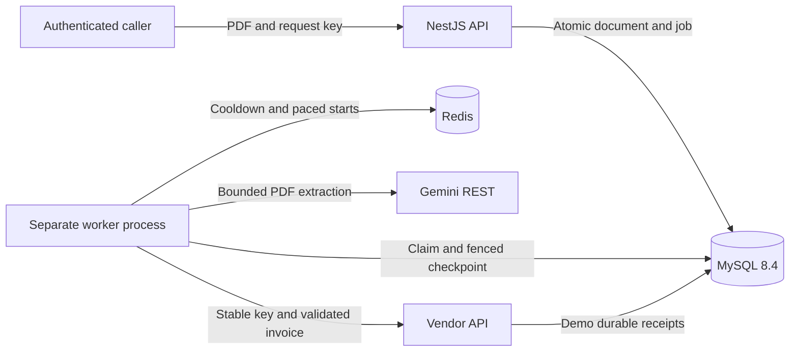
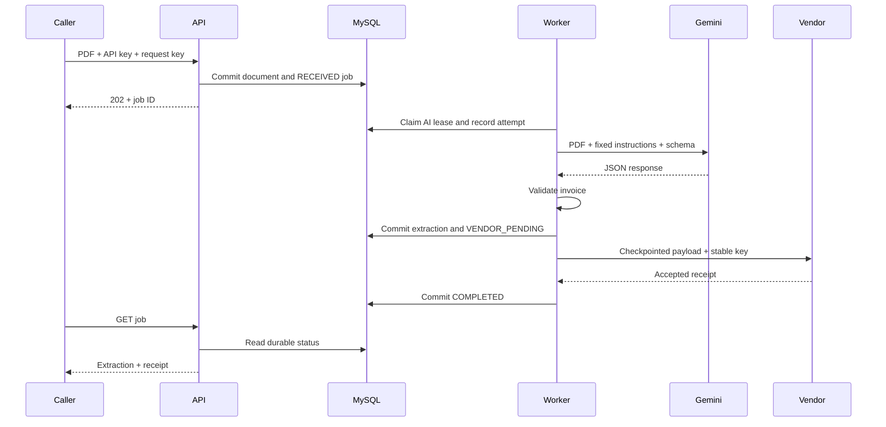
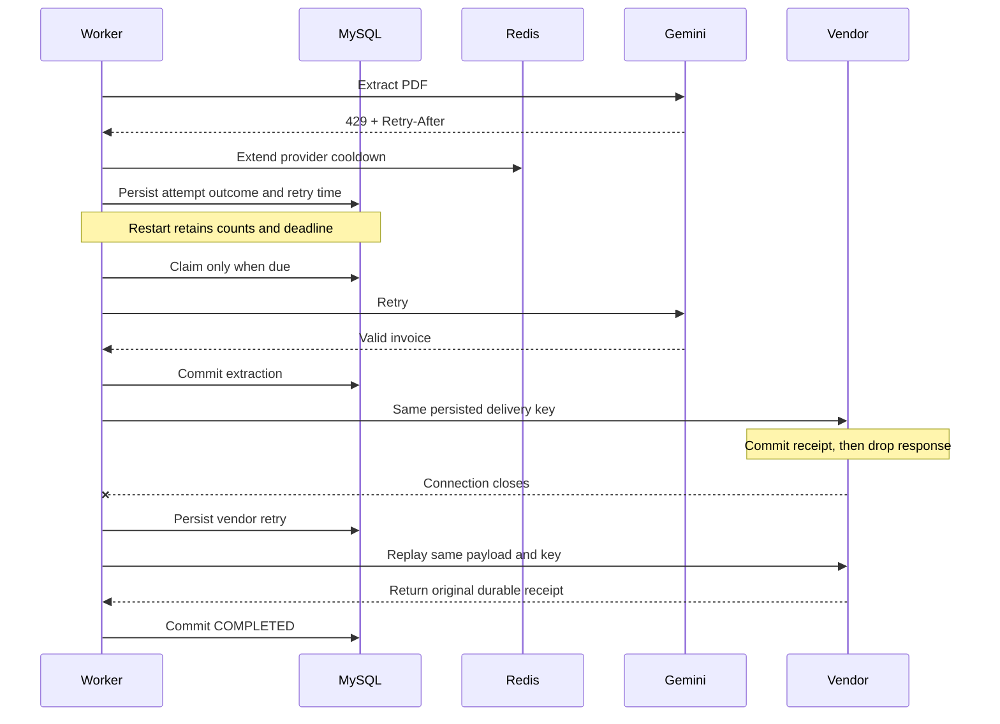

# Architecture and failure handling

## Components

The API accepts and persists work without calling upstream services. MySQL stores the bounded PDF in a separate BLOB table, keeping scheduler/status reads small. A short transaction claims due work with `FOR UPDATE SKIP LOCKED`, commits a token/90-second lease, and releases SQL locks before Redis or HTTP work.

The worker checks the provider gate before atomically recording an attempt. Results, failures, and deferrals require the same job, stage, live lease, and token. Expired claims abandon unfinished audit entries; counters and original deadlines survive. Idle deadlines are swept even while Redis is unavailable. Active calls are cancelled at the minimum of request timeout, remaining stage budget, and remaining lease. SIGTERM stops claims, aborts HTTP, checkpoints the interruption when possible, and closes resources; crashes recover through lease expiry.

## Normal sequence

## Rate limit and uncertain delivery

## Retry and duplicate boundaries

There is one retry owner: the workflow. Adapters perform one application request, classify the result, and do not sleep or retry internally. Retryable outcomes include 429, 408, 5xx, transport errors, and timeouts. Other client errors and safety refusals are terminal. Empty/schema-invalid/truncated AI output has one additional unusable-output attempt. Invalid vendor acknowledgements remain uncertain and retry under the same key.

For failed attempt number `n`, jitter is uniform from zero to `min(cap, 2 seconds × 2^(n-1))`. A valid Retry-After delay is added without truncating it to the backoff cap. HTTP-date calculations and persisted schedules use MySQL time. If no permitted retry fits before the deadline, the stage fails. Redis atomically extends provider cooldown TTLs and checks pacing; individual retry schedules and all durable work remain in MySQL.

Submission keys are SHA-256 hashed and uniquely constrained for the single configured API caller. Exact bytes replay the same job; changed bytes conflict. Vendor keys persist as `<job UUID>:invoice-v1`. The mock validates and normalizes a fixed schema before hashing it, so property reordering preserves the canonical payload. Its unique key binds one hash and receipt.

Delivery is **at least once with deduplicated effects only because the vendor cooperates**. A local flag cannot guarantee exactly-once effects at an arbitrary external API. Receipt retention must cover the retry/job retention horizon. A non-idempotent vendor requires authoritative lookup or reconciliation. An uncertain failed delivery may already have been accepted. A crash before an AI checkpoint may repeat a billable extraction, bounded by persisted attempts.

## Why these choices

- MySQL already owns the workflow; a leased database queue avoids a second durable queue and the MySQL-to-broker publication gap. Redis is transient coordination, not the source of truth.
- Bounded BLOB storage gives atomic acceptance without object-store consistency machinery. It is suitable for this low-volume demonstration.
- Fixed stages and a small schema are sufficient. There is no generalized workflow engine, broker, agent framework, UI, or manual replay API.
- Decimal-string money preserves precision. Schema validity does not establish factual correctness; no payment or coverage decisions are made.
- PDF work runs in a limited worker thread and is terminated at its deadline. Parsing is structural validation, not malware scanning.

## Operational limits

This is a single-caller synthetic-data demonstration. Before handling real patient information, decide identity/tenant isolation, retention/deletion, encrypted storage and key management, provider processing terms/region, audit access, and human validation. Do not infer compliance from these tests.

Database throughput and BLOB retention are bounded operationally, not automatically scaled. Move documents to encrypted object storage and consider an outbox/broker after measured load warrants it. The mock stores counters in memory per job and receipts durably; it is not a real vendor implementation. Redis loss can erase shared cooldowns but cannot erase individual schedules or budgets. Durable app data is retained until deliberately managed.

## Evidence map

| Requirement | Working implementation / check |
| --- | --- |
| Authenticated asynchronous bounded upload | `src/jobs/`; `test/api.integration.ts`, `test/pdf.spec.ts`, blocked-upstream worker test |
| Durable keyed acceptance and replay | `src/persistence/jobs.ts`; concurrent API and full workflow tests |
| Structured Gemini extraction | `src/integrations/gemini.ts`, invoice schema; HTTP/schema/Gemini tests |
| Repeated 429 recovery/exhaustion | Retry policy and shared gate; retry, gate, and failure E2E tests |
| Empty/unusable output non-delivery | Gemini validation; failure E2E tests and zero receipt assertions |
| Over-15-minute deadline behavior | Injected-clock retry test passes 900 seconds; persisted deadline sweep test; shortened real socket cancellation |
| Vendor outage and response loss | Vendor adapter/mock receipts; failure, receipt, and restart tests |
| Concurrent claims and stale results | `WorkflowStore`; real MySQL workflow tests |
| Restart at four checkpoints | `test/recovery.e2e.ts`; executable worker SIGTERM/restart tests |
| Redis outage without lost work | `test/redis-outage.e2e.ts` through a real TCP interruption |
| Safe status, logs, and OpenAPI | `src/http.ts`, response contracts; logging/API/contracts tests |
| Migrations, health, containers | Compose files, explicit migration, health tests and executable worker tests |

See [failure runbook](failure-scenarios.md) and [recorded verification](implementation-evidence.md) for actual run results and remaining limitations.
