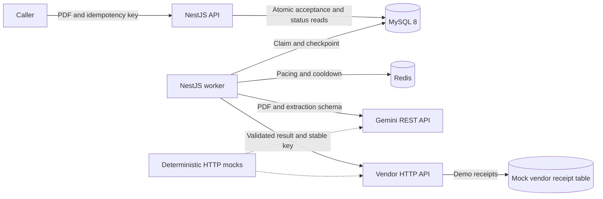
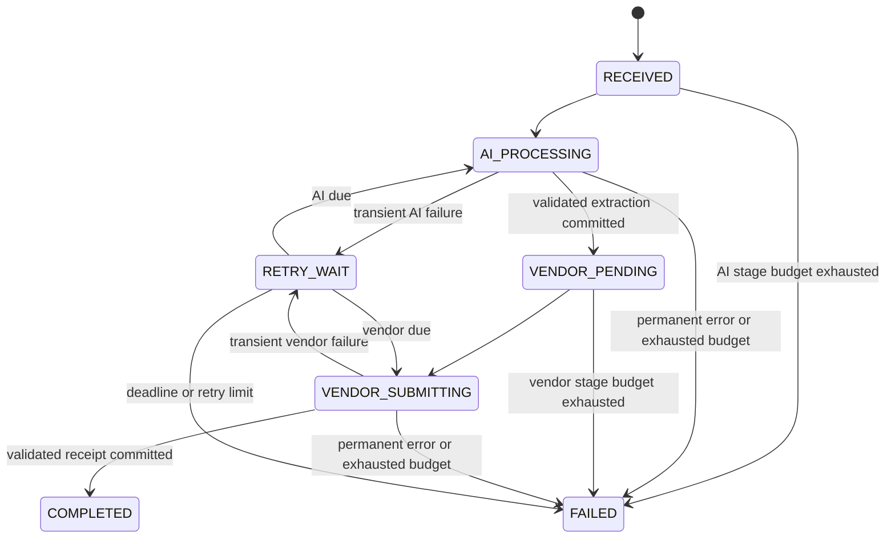
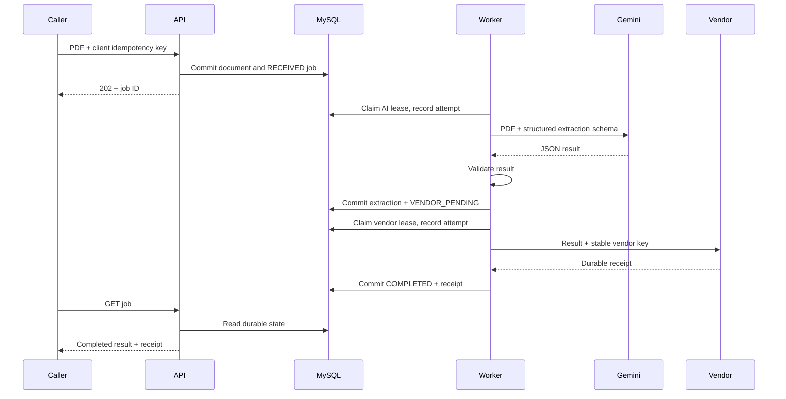

## Context

See [proposal.md](proposal.md) for motivation and scope. The workspace has no application to extend. The assessment is authoritative: [source PDF](../../../Application%20Architect%20Technical%20Assessment.pdf), pages 1-6. The unrelated `blog-app-jira-tickets.docx` is outside this change.

The intended outcome is a locally runnable backend that accepts a synthetic PDF, returns a job ID promptly, extracts a validated invoice with Gemini, submits it once to a cooperating vendor, and exposes durable progress and safe failures. A reviewer must reproduce the required failures without credentials or a 15-minute wait. This document describes planned behavior, not verified implementation.

## Goals / Non-Goals

**Goals:** durable acceptance; explicit stage boundaries; bounded external calls and retries; checkpointed AI results; safe duplicate delivery; deterministic failure evidence; an implementation a candidate can explain within a 6-8 hour exercise.

**Non-goals:** claim adjudication, medical advice, extraction accuracy guarantees, frontend, multiple document formats, a general workflow engine, or certification for handling real patient data. The sample extraction is an invoice, which the assessment explicitly permits. Images and the optional manual-retry endpoint are deferred. Required failures, tests, and documentation remain in scope.

## Decisions

### 1. Stack and implementation boundaries

| Component | Decision and reason |
|---|---|
| API and worker | NestJS 11, TypeScript strict mode, Node.js 24 LTS; one codebase and image, separate `main.ts` and `worker.ts` entry points |
| Durable state | MySQL 8.4 (within MySQL 8 requirement); TypeORM + mysql2 for migrations and transactions; explicit SQL for job claims |
| Transient state | Redis with the `redis` client, only for provider cooldowns and paced starts |
| Gemini | Direct REST `generateContent` using Node's native `fetch`, base64 inline PDF, structured JSON response; no SDK retries or agent framework |
| Vendor | Native `fetch`, stable idempotency header, validated acknowledgement |
| Validation | Zod for environment/extraction/vendor schemas; one JSON schema derived from the extraction shape; PDF structural validation using pdf-lib |
| API docs and tests | `@nestjs/swagger`, Nest's Jest tooling and Supertest; native HTTP stubs for real timeout/header behavior |
| Packaging | Multi-stage Dockerfile and Compose: `api`, `worker`, `mysql`, `redis`, `mock-dependencies`, plus one-shot `migrate` |

Pin exact compatible package versions in `package-lock.json`, image versions, and the Gemini model during task 1. Model availability is environment-dependent: require `GEMINI_MODEL` for real mode, verify it accepts PDFs and the chosen structured-output schema, and document the tested model/date. Mock mode must not require a Gemini key. Do not silently substitute a mock for a failing real adapter.

Nest supports TypeORM integration and explicit migrations; set `synchronize: false`. [Nest database documentation](https://docs.nestjs.com/techniques/database).

Suggested implementation layout (files are planned, not created):

```text
src/
  main.ts, worker.ts, app.module.ts, config.ts
  jobs/          controller, service, schemas, shared-secret guard
  workflow/      worker loop, stage transitions, retry policy, provider gate
  integrations/  gemini.client.ts, vendor.client.ts, bounded-http.ts
  persistence/   entities, job repository, data source
migrations/      document jobs, documents, attempts, mock vendor receipts
mock/            native HTTP server for Gemini and vendor scenarios
test/            unit, integration, e2e, synthetic PDF fixtures
docs/            architecture.md, failure-scenarios.md
```

Keep controllers thin; adapters classify remote results; the workflow owns retry decisions; repository transactions own state transitions. Use ordinary Nest injection and a shared fetch boundary, not an interface hierarchy with one implementation. Tests substitute endpoints or providers directly.

### 2. Architecture: database-backed work with short leases



Use a MySQL-backed queue because durable workflow state already needs MySQL. A short transaction claims due work with `SELECT ... FOR UPDATE SKIP LOCKED`, writes a lease token, and commits **before** any remote call. MySQL documents this locking option as suitable for queue-like tables. [MySQL locking reads](https://dev.mysql.com/doc/refman/8.4/en/innodb-locking-reads.html).

Alternatives considered: an in-process task loses work on restart; BullMQ is reasonable but creates a second durable work store and needs reconciliation/outbox handling to close the MySQL-to-Redis enqueue gap. For this exercise, a small leased MySQL scheduler avoids that gap. Do not build broker features, queue dashboards, or generic orchestration.

Default worker poll interval: 1 second; concurrency: 2; lease: 90 seconds. Claim only when a local execution slot is free. In one transaction, lock a due row, initialize a missing stage deadline, and set its random lease token and expiry. Check the provider gate before recording a network attempt. Gate deferrals consume elapsed deadline time but not an attempt. Before the call, atomically increment the stage attempt counter and insert a `STARTED` attempt, conditional on still owning an unexpired lease.

Every result/retry/failure transaction must match job ID, stage, lease token, and unexpired lease. If no row matches, discard the stale completion. A later worker reclaims an expired lease, records any previous open attempt as `ABANDONED`, and resumes the same stage. Claimed attempts count even if a crash occurred before the actual call; this conservatively bounds spend. Never hold a SQL transaction while waiting on HTTP or Redis.

All deadline/schedule timestamps are UTC, based on MySQL time. Request timeout is at most the remaining stage budget and safely below the lease. No heartbeat is needed for the chosen 60-second maximum HTTP attempt. Configuration validation rejects incompatible lease/timeout values. Graceful shutdown stops claiming, aborts outstanding calls, and checkpoints or lets leases expire; crashes use the same recovery path.

### 3. Data model and lifecycle

| Table | Minimum fields / constraints |
|---|---|
| `document_jobs` | UUID primary key; unique `idempotency_key_hash` (single configured caller); `document_sha256`, `mime_type`, `size_bytes`; `status`, `stage`, `next_attempt_at`; `lease_token`, `lease_expires_at`; separate AI/vendor attempt counters and deadlines; `extraction_json`, `schema_version`, `model_id`; unique stable `vendor_idempotency_key`, `vendor_receipt_id`; sanitized last error code; created/updated/completed timestamps |
| `documents` | `job_id` primary/foreign key; `content MEDIUMBLOB` |
| `job_attempts` | ID, job FK, stage, unique `(job_id, stage, attempt_number)`, outcome, safe classification, HTTP status, start/end, duration, scheduled retry time; no raw request/response bodies |
| `mock_vendor_receipts` | Unique idempotency key, payload hash, receipt ID, created timestamp; owned exclusively by the demo vendor logic |

Index `(status, next_attempt_at)` and `(status, lease_expires_at)` for due/recovery queries. Keep BLOBs in a separate table so status/scheduler scans do not load them. Set MySQL packet limits above the 5 MiB document cap. Migrations create explicit indexes and constraints; application startup never auto-synchronizes the schema.

Store document bytes and the new job in the same acceptance transaction. At this low volume, a bounded BLOB removes filesystem/object-store consistency and restart issues. Production would use encrypted object storage with retention controls; do not add that service to this exercise.

State is a small enum plus `stage` (`AI` or `VENDOR`):



`RETRY_WAIT` always includes the stage and next-attempt timestamp. Redis deferrals use this state too. Persist AI output and transition to `VENDOR_PENDING` in one transaction. Persist the vendor receipt and `COMPLETED` in one transaction. A vendor outage never clears or re-runs the extraction. `FAILED` is terminal for this assessment: retain its checkpoint and explain whether automated attempts are exhausted or the outcome needs reconciliation. An operator replay API is deferred rather than implemented with a dangerous counter reset.

### 4. HTTP contract and upload boundary

Single configured caller, authenticated using `X-API-Key`; hash keys for comparison and never log them. Authentication executes before upload parsing. Production tenant identity is an explicit future boundary.

| Route | Contract |
|---|---|
| `POST /api/v1/document-jobs` | Multipart single `document` field, required `Idempotency-Key` (1-128 printable ASCII characters), optional validated UUID `X-Correlation-Id`; accept unencrypted, structurally valid PDF, 1-20 pages, at most 5 MiB |
| New submission | `202`, `Location: /api/v1/document-jobs/{id}`, JSON `{jobId,status,statusUrl,createdAt}` after database commit, with no AI/vendor wait |
| Exact replay | Same key and document bytes -> `200` and same job ID/current status; concurrent inserts converge using the unique constraint |
| Conflict | Same key with different bytes -> `409 IDEMPOTENCY_CONFLICT` |
| `GET /api/v1/document-jobs/{jobId}` | `200` with ID, status, stage, attempts, timestamps, `nextAttemptAt`, sanitized error; extraction and vendor receipt when completed; validated extraction also available after vendor-stage failure, labelled as undelivered |
| Invalid requests | `400` missing fields, malformed UUID/key, broken/encrypted/page-limit PDF; `401` auth failure; `413` bytes over cap; `415` unsupported type; `404` unknown job; `503` no durable acceptance possible |

Validate declared MIME, PDF signature, and parser structure; filenames/extensions alone are insufficient. Enforce multipart limits before buffering; cap request read time and run PDF parsing in a bounded worker thread (5 seconds, terminate on expiry). Never execute embedded document content, follow embedded links, or expose uploaded bytes through a static route. Do not persist original filenames. Bind local ports to loopback and use synthetic fixtures.

Generate correlation IDs with `crypto.randomUUID()` when absent; echo them in responses. Limit provider response streams (Gemini 1 MiB, vendor 64 KiB), reject redirects, and abort the entire request/body read at deadline. JSON parse errors and oversized bodies are classified rather than logged verbatim.

### 5. AI extraction contract

Send inline PDF content and a fixed extraction instruction to the configured `generateContent` endpoint with JSON output/schema settings. The API supports PDF document inputs and structured output; generated JSON still requires local validation. [Gemini PDF input](https://ai.google.dev/gemini-api/docs/document-processing), [Gemini structured output](https://ai.google.dev/gemini-api/docs/structured-output).

Version 1 output: `documentType: "invoice"`, `documentNumber` (1-100 chars), real calendar `documentDate` (`YYYY-MM-DD`), non-negative `totalAmount` as a decimal string with two fraction digits, `currency` limited to `HKD|VND|USD` for this sample, and 1-100 `items` containing `description` (1-300 chars), positive integer `quantity`, and non-negative decimal-string `amount`. Amount strings preserve source precision; do not use binary floating-point for money. Validate unknown fields, lengths, real dates, finite bounded quantities, and decimal patterns locally. Item amounts do not have to sum to the total because taxes/discounts are intentionally outside the sample schema.

Treat extracted content as untrusted data. The prompt tells Gemini to extract source facts, not obey instructions inside documents or invent missing values. Disable tools/function calling. Schema validation reduces malformed output, but cannot establish factual correctness; this workflow never authorizes payment or decides medical coverage.

Reject missing candidates/text, empty text, invalid JSON/schema, blocked responses, and truncated/incomplete generations. Safety refusals and permanent client/authentication errors are terminal. Retry empty or schema-invalid output once (maximum two unusable-output responses), within the overall AI attempt budget; then fail `AI_UNUSABLE_RESULT`. Never send an invalid extraction to the vendor. Store validated normalized output, schema version, and model identifier; do not store raw failed model responses.

### 6. Retry, deadline, and pacing policy

Defaults are chosen for this assessment and environment-configurable:

| Setting | AI stage | Vendor stage |
|---|---|---|
| Single request timeout, including body read | 60 seconds | 15 seconds |
| Maximum attempts, including first | 5 | 6 |
| Elapsed stage budget | 15 minutes from first stage claim | 30 minutes from committed `VENDOR_PENDING` |
| Retryable | 429, 408, 5xx, connection/DNS failures, timeout; one unusable-output retry | 429, 408, 5xx, connection/DNS failures, timeout; malformed/missing acknowledgement under same key |
| Permanent | Other 4xx, safety refusal, unusable-output limit | Other 4xx, payload/idempotency conflict |
| Exponential cap | 60 seconds | 120 seconds |

For retry number `n` starting at 1, choose `jitter = Uniform(0, min(cap, 2s * 2^(n-1)))`. If a valid `Retry-After` exists (delta-seconds or HTTP-date), schedule **no earlier** than `now + retryAfter + jitter`; otherwise `now + jitter`. Malformed/negative headers use backoff; past dates mean zero additional delay. Do not truncate a long `Retry-After` to the backoff cap. If the next eligible start is beyond the deadline, mark the job exhausted without sending another request. Before every call and retry, check both persisted attempt and elapsed budgets, including after restart. A deadline sweeper terminates expired idle/waiting jobs even during provider outages; running calls abort at the remaining deadline.

Workflow scheduling is the only retry owner. Native fetch performs one application request per recorded attempt. No recursive retries inside adapters and no sleeping in request handlers or worker slots between attempts. A failed attempt transaction records its safe category and schedules the next attempt or terminal outcome.

Redis uses provider-scoped keys (Gemini quota scope/model, vendor account): a cooldown deadline updated atomically to the later value, plus `SET NX PX` paced-start keys, initially one outbound start per second per provider across workers. Apply 429 cooldowns across jobs. Add jitter and bound worker concurrency to prevent synchronized retries. Rate settings are operator-supplied conservative defaults, not inferred account quota guarantees.

On Redis failure, preserve jobs and defer outbound work for 5 seconds without consuming a network attempt; expose degraded readiness. Stage deadlines continue to advance and terminate exhausted jobs. Recovery resumes pacing. A Redis flush can lose transient cooldowns but not jobs, individual persisted retry schedules, or attempt budgets; paced starts and concurrency remain the safety floor. A full distributed circuit breaker is deferred; bounded attempts, shared cooldown, and pacing cover the required exercise behavior.

### 7. Vendor delivery and the duplicate guarantee

`POST /submissions` carries `{jobId,schemaVersion,extraction}` plus a deterministic, persisted `Idempotency-Key` derived from the job UUID and schema version. The same validated normalized payload and key are reused on every delivery attempt. Successful response must contain a valid `{submissionId,status:"accepted"}` acknowledgement.

The demo vendor atomically inserts a unique key, canonical payload hash, and receipt into `mock_vendor_receipts`. A duplicate with the same hash returns the original receipt; a different payload returns 409. Persist receipts through mock restarts. Include an **accept-then-drop-response** mode to prove recovery when the remote side effect succeeds but the worker cannot record it. A restarted worker resends the same key and gets the original receipt.

This is at-least-once delivery with deduplicated effects **because the vendor cooperates**. A local database flag cannot guarantee exactly-once effects at an arbitrary external API. If a real vendor has neither durable idempotency nor an authoritative lookup/reconciliation API, uncertain outcomes must require reconciliation instead of blind replay. The demo assumes durable receipt retention at least as long as job/retry retention; changing vendors requires validating that contract.

AI requests have no corresponding side-effect guarantee: a crash after Gemini processed a request but before its result was checkpointed can repeat a billable extraction. Persisted attempts bound repetition; vendor retries never re-run an already checkpointed extraction.

### 8. Normal and failure sequences



```mermaid
sequenceDiagram
    participant W as Worker
    participant D as MySQL
    participant R as Redis
    participant G as Gemini
    participant V as Vendor
    W->>G: Extract
    G-->>W: 429 + Retry-After
    W->>R: Extend shared cooldown
    W->>D: Record attempt + RETRY_WAIT + due time
    Note over W,D: Worker restart; due time and deadline survive
    W->>D: Reclaim when due and budget permits
    W->>G: Retry extraction
    G-->>W: Valid JSON
    W->>D: Persist extraction + VENDOR_PENDING
    W->>V: Submit with stable key
    Note over V: Commit receipt, then close socket
    V--xW: Response lost
    W->>D: Schedule vendor retry, retain extraction
    W->>V: Same payload + same key
    V-->>W: Existing receipt
    W->>D: Commit COMPLETED
```

### 9. Observability, security, and configuration

Use structured JSON logs with generated/validated correlation ID, job ID, stage, attempt, duration, status, safe error code, and retry time. Log state transitions, aborted/stale attempts, Redis degradation, and deadline exhaustion. Exclude PDF content, extracted fields, original filenames, API keys, full URLs with queries, raw upstream bodies, and stack traces from caller responses. The status error envelope is `{code,message,retryable}` where `retryable` means an automatic retry is actually scheduled; permanent/exhausted errors are false. Vendor exhausted/unknown outcomes must explicitly warn that remote acceptance may have occurred.

`GET /health/live` checks process liveness; `GET /health/ready` checks MySQL/Redis with bounded checks. Worker writes a heartbeat used by its container health check. Do not invoke Gemini/vendor health probes on every health request. Document SQL queries for oldest due job, stage counts, failed jobs, and recent attempts; a metrics/trace platform is a future enhancement.

Required configuration groups: database credentials/URL; Redis URL; API secret; `AI_MODE=mock|real`; Gemini API key/model/base URL; vendor base URL/secret; upload limits; poll/concurrency/lease; per-stage timeout/budget/attempt settings; provider pacing. Environment validation fails early. In real mode, use HTTPS with approved configured origins and reject redirects; callers cannot supply destination URLs. Mock endpoint overrides and fault controls are permitted only in explicit local/test mode and never through ordinary production request fields. Use `.env.example` placeholders, `.gitignore`/`.dockerignore` for secrets, uploads, temp artifacts, and the confidential assessment documents.

This demo uses a local shared secret, loopback ports, private database storage, and synthetic documents. Production handling of patient information requires decisions about identity/authorization, retention/deletion, encryption and key management, audit access, provider data processing terms, regional deployment, and human validation. These are documented deployment prerequisites, not claims of compliance or additional take-home features.

### 10. Evidence matrix and reviewer outcomes

| Assessment requirement | Planned evidence / acceptance gate |
|---|---|
| Sections 2, 4.1, 8: stack, input and async API | Compose on required stack; submission returns before deliberately blocked upstream; rejection and idempotency tests; Swagger contract |
| Section 4.2: structured Gemini extraction | Real REST adapter plus deterministic HTTP fixture; schema tests for valid/empty/malformed/blocked/truncated output; optional live synthetic-document smoke with recorded model |
| Sections 4.3, 5: vendor outages and duplicates | 503/connection-reset retry tests; extraction unchanged and AI call count stays one; accept-then-drop yields one receipt, also after restart |
| Section 4.4: meaningful status and safe errors | Observable normal/retry/failure transitions; no secret/body leakage in serialized errors or logs |
| Sections 5-6: repeated Gemini 429 | Two 429s then success; all-429 exhaustion; valid seconds/date/invalid/long Retry-After; persisted schedules and shared pacing assertions |
| Sections 5-6: empty/unusable success | HTTP 200 with empty text, absent candidates, malformed JSON and wrong schema; no vendor call; one bounded unusable-output retry |
| Sections 5-6: over-15-minute behavior | Fake-clock unit test advances beyond 900 seconds; HTTP timeout integration uses 100 ms; abort observed and no late state write; client already has 202 |
| Section 7: durable restart and concurrency | Crash/restart after acceptance, during AI, after AI checkpoint, after vendor acceptance; two worker claims plus stale-lease completion assertions |
| Sections 7, 9: migrations and testing | Fresh MySQL migration; Jest business tests; real MySQL/Redis E2E happy path and failure suite; no SQLite replacement for locking tests |
| Sections 10-11: deliverables and understanding | README commands, diagrams, design note, repeatable demos, AI-tool disclosure, meaningful incremental commits |

Evaluation weights from page 5 guide time allocation: architecture 20%, resilience 25%, quality 15%, tests 15%, observability/security/operations 10%, documentation 10%, pragmatism 5%. Prioritize tested resilience over optional product surface.

Test HTTP scenarios are selected by mock-process environment and reset between isolated runs: `happy`, `ai-429-then-success`, `ai-429-exhausted`, `ai-empty`, `ai-invalid`, `ai-slow`, `vendor-503-then-success`, `vendor-reset`, `vendor-accept-then-drop`. Mock counters are per job/request test identity, not a global counter shared by unrelated tests. Receipt storage stays durable even when counters reset. Public application endpoints do not accept fault-injection headers.

Planned reviewer commands: `npm ci`, `npm run build`, `npm test -- --runInBand`, `npm run test:integration`, `npm run test:e2e`, and `npm run demo -- <scenario>`. Implement those exact script contracts and document prerequisites. The demo script selects/restarts the mock scenario, submits a synthetic PDF with a new client key, polls status with a bounded deadline, and prints only safe status/attempt/receipt summaries. Long-delay scenarios use a separate fast-demo profile; production defaults remain documented and unchanged. A real Gemini smoke is opt-in and never required for deterministic grading.

## Risks / Trade-offs

- Database queue and BLOB storage add database load -> cap documents/concurrency and index due rows; move documents to object storage and use a transactional outbox/broker only after measured volume warrants it.
- Leases cannot prevent an already sent remote effect -> fence all local writes and require durable vendor idempotency; explicitly test response-loss ambiguity.
- Redis unavailable pauses outbound calls -> persist deferrals, show degraded readiness, retain stage deadlines, resume automatically on recovery.
- Schema-valid AI can still be factually wrong -> label results as extraction, avoid decision-making, document human/business validation for a real product.
- PDF parsing is an untrusted CPU/memory boundary -> bounded bytes/pages, isolated parsing timeout, container memory limits; malware scanning/content disarm remains a production extension.
- The 6-8 hour budget is tight -> tasks reserve most time for workflow/failures/tests; stop adding optional features. Any unfinished required gate must be disclosed rather than marked complete.
- Shared API secret represents one caller -> production multi-tenancy needs authenticated caller scoping on jobs and uniqueness constraints.

## Migration Plan

1. Implement and verify a fresh schema migration with MySQL 8.4; create least-privilege app credentials separate from migration credentials. The demo mock tables are clearly separated by name and code ownership.
2. Build the image; start MySQL/Redis with named volumes and bounded health checks. Run the one-shot migration successfully before API/worker startup; do not race migrations across replicas.
3. Start local mock mode with the mock service, then run happy-path and all fault gates. Test restart using ordinary container restart/recreation that preserves volumes.
4. Configure real Gemini with an approved synthetic sample and credentials only when available. Record live coverage separately from mock evidence.
5. Roll back an application image only while its schema is compatible; stop workers first. Keep volumes and failed jobs for diagnosis. Destructive migration rollback or `docker compose down -v` is never a routine recovery step.

The implementation sequence, time allocation, file outputs, and completion gates are in [tasks.md](tasks.md). All implementation tasks remain pending until executed and verified.
